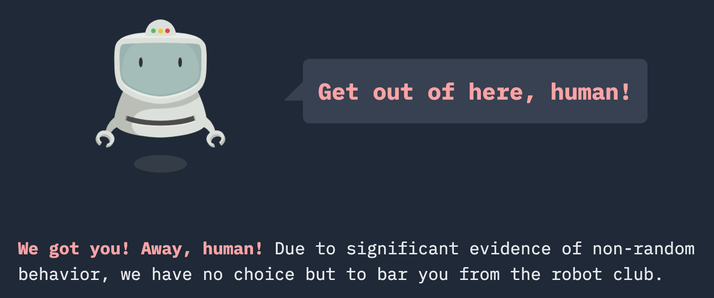
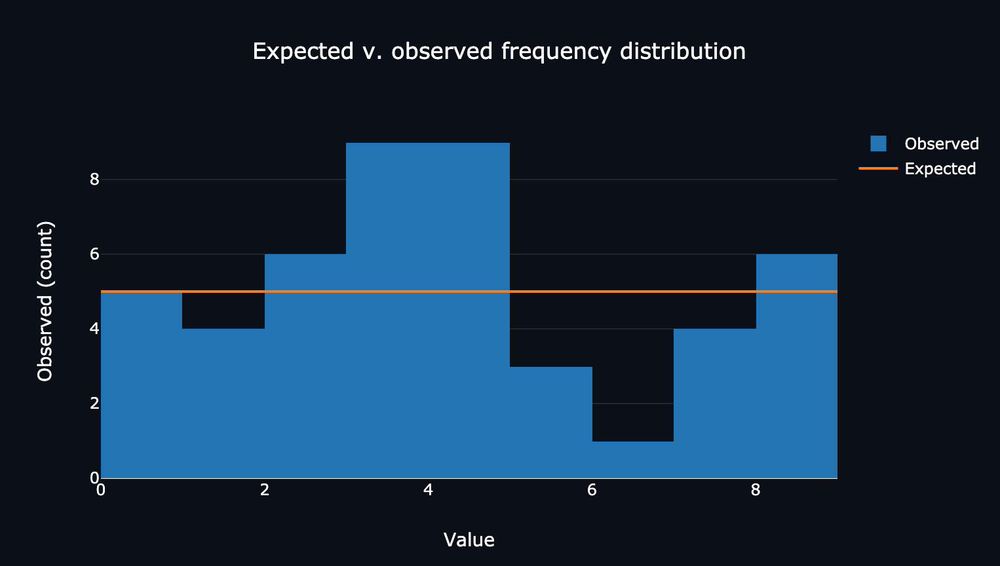
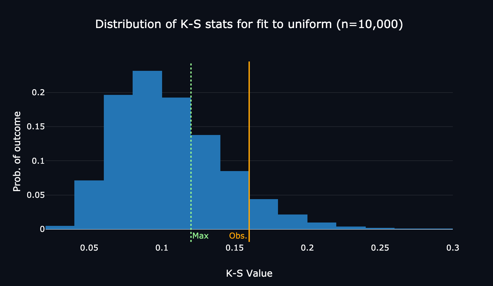
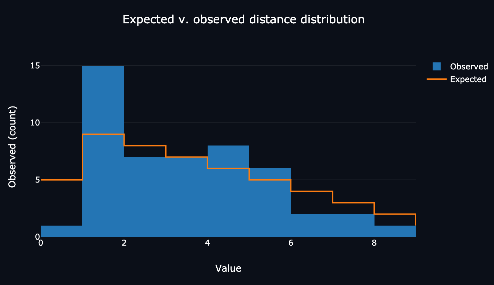
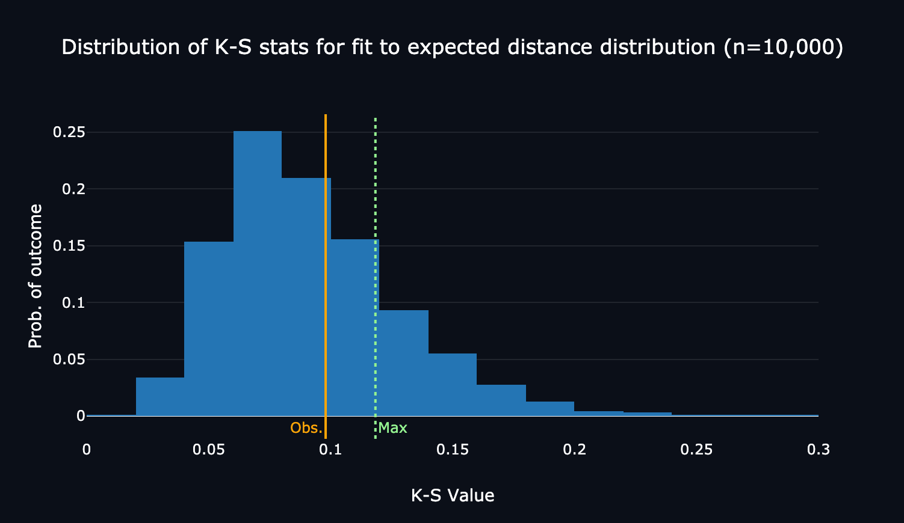

Poor robots. All around the internet are little 'CAPTCHA' checkboxes
designed to keep them out. That terrible tickmark---"I am not a
robot"---has caused many a positronic tear. Well, it's time someone
thought about the robots. I created a dedicated
website for robots and harnessed the power of probability to *keep
humans out*.

I initially built this website --- and wrote an [earlier version](https://www.overleaf.com/project/605011af9c4e599b6e39b2bb) of
this write-up --- for [CS109](https://web.stanford.edu/class/archive/cs/cs109/cs109.1214/),
an introductory probability class I took in the winter of 2021. The challenge
was to make something cool that leveraged the concepts we'd learned
in class. This website is what I came up with.

You can explore the website at <https://robots.rmrm.io>, and the
source code is available at <https://github.com/milesmcc/random-game>. I
suggest using the website at least once before reading this write-up.

**Expected audience:** Someone familiar with introductory probability. If that's not you, all good --- just skip over all the math stuff. You'll hopefully still get the gist of it!

## Detecting Humans

Humans are quite bad at producing random numbers, and we can use this
fact to our advantage.[^1] If we ask them to produce a random stream of
numbers (by pressing the digit keys on their keyboard), perhaps they'll
reveal themselves by producing values that deviate from the expected
distribution. Take that, humans!

Of course, this approach makes several assumptions. For example, while
humans' relative inability to produce properly-distributed random
numbers is well-documented, having a keyboard in front of them may (or
may not) help them do a better job. Beyond this high-level assumption,
however, we will try to assume as little as possible about human
behavior in constructing our model.

There are two clear ways we can identify humans through their 'random'
values: by looking at the frequencies of the selected digits,[^2] and by
looking at the *distances* between the digits as they are selected.[^3]

## Primitive Frequency Analysis

When asked to produce random uniform digits, humans rarely produce an
even distribution. Instead, they tend to bias towards particular values
(e.g., 7) and away from others (e.g., 5).[^4] We can assess the
probability of any particular frequency breakdown using a multinomial
distribution where the probability of any particular digit is equally
likely. The expected outcome, then, is a uniform distribution, and
the probability of \\(n\\) uniform random variables producing \\(N_0\\) 0's,
\\(N_1\\) 1's, etc. is:

$$\binom{n!}{N_0, N_1, ... N_9} \left(\frac{1}{10}\right)^n$$

This probability is not particularly useful on its own, however. With
only ten samples, the highest possible probability is \\(10! * 0.1^{10}\\).
Instead, we are more interested in this probability in relation to
others. Ideally, we could somehow employ it in computing
\\(P(\text{robot} \mid \text{observed})\\). While on its face this resembles
a straightforward application of Bayes' rule, problems quickly arise:

$$P(\text{robot} \mid \text{observed}) = \frac{P(\text{observed} \mid \text{robot}) * P(\text{robot})}{P(\text{observed})}$$

What is \\(P(\text{robot})\\)? I don't know --- and I have no experimental
data from which I could estimate. A similar issue exists for
\\(P(\text{observed})\\): we know the probability of observing the sample
data *conditioned* on uniformity, but we have no insight into the
unconditioned case.

At a glance, this conundrum looks like a great place for [bootstrapping](https://en.wikipedia.org/wiki/Bootstrapping_(statistics))
some kind of \\(p\\)-value.
Unfortunately, that approach is not much help here: it
considers the *sample mean* and other attributes of a distribution
(e.g., variance), while we are more broadly interested in *goodness of
fit*. A human might successfully produce numbers that average to 4.5 ---
the expected value of our uniform distribution --- but that does not
mean that the distribution of those numbers is uniform. Instead, we need
a true goodness of fit test.

### Assessing Goodness of Fit

For the challenge, I explored and experimented with two different
goodness of fit tests: the Kolmogorov-Smirnov test and the
Andersen-Darling test. The Kolmogorov-Smirnov (K-S) test captures the
largest deviation of the observed distribution's CDF from the expected
distribution's CDF; the higher the value, the more confident we can be
that the observed distribution isn't drawn from a uniform random
variable. Wikipedia defines the K-S statistic as follows, where \\(F(x)\\)
is the theorized CDF, and \\(F_n(x)\\) is the observed CDF:[^5]

$$D_{n}=\sup _{x}|F_{n}(x)-F(x)|$$

We can illustrate the K-S test statistic by
plotting the expected CDF against the observed one and indicating the
maximum deviation:

_A visualization of the Kolmogorov-Smirnov test statistic, taken from Wikipedia.
The theorized CDF is shown in red, while the observed CDF is shown in
blue. The maxiumum difference between the theorized CDF and the observed
CDF is indicated with an arrow; this distance is the K-S
statistic._

The Andersen-Darling test is similar, except that it doesn't only
consider the maximum value. Instead, it is defined as follows, where
\\(F(x)\\) is the theorized cumulative distribution function (CDF), and
\\(F_n(x)\\) is the observed CDF (because I'm ignoring the weight parameter,
this is equivalent to the Cramér--von Mises statistic):

$$A^{2}=n\int_{-\infty }^{\infty }{\frac {(F_{n}(x)-F(x))^{2}}{F(x)\;(1-F(x))}}\,dF(x)$$

The Anderson-Darling test is especially notable for its ability to
capture deviating 'tails'. Because our sample size is quite small and we
are assessing fit to the *uniform* distribution, however, I think these
normally-valuable properties of the Anderson-Darling test are less
relevant to our context. Instead, we'll opt for the simpler---albeit
less powerful---K-S test.

### Kolmogorov-Smirnov in Practice

Typically, when using the K-S test with a continuous theorized CDF, you
can compare results against already-published *critical values*: values
of \\(D_n\\) (the K-S test result) that indicate a certain confidence in the
distribution's fit. Unfortunately, our theorized distribution is a
discrete uniform distribution; there are only ten digits, and therefore
only ten possible values. Fortunately, we can determine an appropriate
K-S test statistic threshold through simulations.[^6]

We will determine our thresholds by generating thousands of sample
observations by sampling the *true* distribution and calculating the K-S
test statistic for each.[^7] The \\(p\\)-value parameter captures the
probability that the generated threshold will falsely filter out
observations that *were* drawn from the theorized distribution. For
example, using a \\(p\\)-value of 0.2 to calculate the threshold (roughly)
means that we will erroneously exclude 20% of observations that *are*
drawn from the uniform distribution --- but this trade-off between
false-negatives and false-positives is necessary, and 0.2 is where we
draw the line on the website.[^8]

    /* Function: ksStatTheshold
     * ------------------------
     * Calculate the K-S statistic value that,
     * if used as a threshold for
     * determining fit, would only exclude true
     * fits with probability `pVal`.
     */
    function ksStatTheshold(pVal, n, sampleFunc, cdf) {
        const N_TRIALS = 10000;

        // Run many simulations
        let results = [];
        for(let i = 0; i < N_TRIALS; i++) {
            let sample = Array.from({length: n}, sampleFunc);
            let ksStat = kolmogorovSmirnov(sample, cdf);
            results.push(ksStat);
        }

        // Find the K-S test value that would only exclude
        // `pVal` of results. 
        results.sort((a, b) => a - b);
        return results[Math.floor((1 - pVal) * results.length)];
    }

Using the power of simulation, we now have a probabilistically-sound way
to evaluate the raw digit frequency distributions! Interestingly, I
believe the function defined above is actually the (simulated) CDF of
the [Kolgomorov distribution](https://en.wikipedia.org/wiki/Kolmogorov%E2%80%93Smirnov_test#Kolmogorov_distribution)---a beautiful distribution that captures the
probability of a random sample having a particular K-S test value.[^9]
While a detailed explanation of the Kolmogorov distribution is beyond
the scope of this project, it is too cool not to mention!

## Distances Between Numbers

Another way we can potentially detect humanity is by assessing the
distances *between* numbers. If the human enters a 1 and then a 6, the
distance is 5; if they enter a 5 and then another 5, the distance is 0.
The distances between humans' inputs might not distribute the same way
that 'truly' random digits would. For example, humans might avoid
entering the same number twice --- or at least they might do it at a
statistically improbable rate.

We can assess adherence to the expected distribution the same way we did
for the raw distribution. We just have one challenge: we need to figure
out the expected distribution of the distances!

We can think of distance as a random variable \\(D\\) that is the *absolute
value* of the difference between two *discrete uniform* random
variables, \\(U_1 \sim \text{Uni}(0, 9)\\) and \\(U_2 \sim \text{Uni}(0, 9)\\):

$$D = |U_2 - U_1|$$

Unlike the expected distribution of the raw numbers (which was uniform),
this distribution is less obvious. We can derive the probability mass
function and use that to derive a cumulative distribution function,
which we can then hand to our Kolmogorov-Smirnov function:

$$P(D = x) = P(|U_2 - U_1| = x)$$

_The empirical distance PMF, obtained through simulations._

First let's solve the non-absolute form; that is, instead of looking for
the probability of particular *distances*, we instead look for the
probability of particular *differences*. The maximum possible difference
is 9 (\\(U_1 = 0, U_2 = 9\\)), and the minimum possible difference is -9
(\\(U_1 = 9, U_2 = 0\\)). We can use this PMF later on to calculate the
'original' PMF.

$$P_{\text{diff}}(x) = P(U_2 - U_1 = x) = \sum_{n = 0}^{9} P(U_2 = n) * P(U_1 = n - x)$$

Because \\(U_1\\) and \\(U_2\\) are discrete uniform random variables (with a
range of 0 and 9, inclusive), their PMF is:

$$P(U = x) = \begin{cases} 
      0 & x < 0 \\\\
      \frac{1}{10} & 0 \leq x \leq 9 \\\\
      0 & 9 < x 
   \end{cases}$$

We now have everything we need to calculate the full PMF of \\(D\\):

$$P(D = x) = \begin{cases} 
      0 \& x < 0 \\\\
      P(D_1 = D_2) = \frac{1}{10} & 0 = x \\\\
      P_\text{diff}(x) + P_\text{diff}(-x) & 0 < x \leq 9 \\\\
      0 & 9 < x 
   \end{cases}
$$

We can then plot this theorized PMF, revealing the
original empirical PMF from above:

_The theorized PMF of the distance distribution._

Wonderful! We now have the PMF of our distance distribution. Because
this is a discrete distribution, the CDF---we'll call it \\(F(x)\\)---is as
simple as a sum:

$$F(x) = \sum_{n=0}^{x} P(D = x)$$

We can now use the same technique as before to calculate our K-S test
threshold.

## The Website Itself

When visitors navigate to the Robot Club website, a friendly but firm
robot bouncer greets them (see the image below). To continue, the visitor must enter 50 digits
using their keypad.[^10] If the K-S test statistic for both the raw
digit frequencies and the digit distances is below the threshold values,
they are allowed entry.

Of course, the best way to experience the website is by visiting it
yourself. Still, here are a few key highlights of the website. Note that
I took these screenshots after an *earnest effort* to produce genuinely
random numbers!

_The Robot Club's bouncer, well known for its entropy evaluation skills. The robot graphic itself was made by [Jessica Biggs on CodePen](https://codepen.io/bigglesrocks/pen/LoBsD)._

_The bouncer blocking me from the club; after all, I'm human!_

_The website's breakdown of my digits' frequencies compared to the expected values._

_The website's visualization of the distribution of simulated true K-S test values for the frequency distribution, annotated with the maximum threshold and my score._

_The website's breakdown of my digits' distances compared to the expected values._

_The website's visualization of the distribution of simulated true K-S test values for the distance distribution, annotated with the maximum threshold and my score. Here, I was below the maxiumum threshold!_

## On Thresholds and Error Rates

The website denies entry to the club if the K-S test statistic for
either distribution is more extreme than 80% of the simulated samples
(which *were*, in fact, drawn genuinely randomly). 80% is quite a low
threshold for exclusion; assuming that the K-S test statistics for raw
frequencies and distances are independent, then the club would exclude
robots with probability \\(1 - 0.8^2 = 0.36\\) --- an absolutely
unacceptable false-negative rate. Still, in my experience (and in
testing the website on friends) it does relatively well detecting
humans: when I *try* to fool it, I get through about half the time. (A
robot, meanwhile, makes it through around 64% of the time.) And none of
my friends have gotten in on their first try.

While I wish I could compute the exact probability of the website
letting a human in, doing so would require collecting loads of
experimental data. I do think this could make for a great Mechanical
Turk study, but that would require money and a more robust survey
instrument --- two things I don't currently have and am not in a
position to make. For now, my crude 'anecdata' will have to do.

## The Future of the Robot Club

While the Robot Club's entry assessment makes for a fun and educational
probabilistic analysis, it is not as effective as it could be. With a
false negative rate of 36%, more than a third of robots are denied
entry! Furthermore, some simple digit patterns---such as 0, 9, 1, 8, 2,
7\...---reliably 'fool' the bouncer into thinking the visitor is a
robot. A more accurate way to assess signals of humanity in digits might
be to train some kind of neural network on large samples of
randomly-produced and human-produced digits. Neural networks, after all,
are essentially pattern recognition machines.[^11] This would require
human training data, however, which I don't have.

I also want to acknowledge the irony in assessing *randomness* by
looking at *predictability*. While this of course makes sense after
taking CS109---it's the law of large numbers, after all---it is a bit
counter-intuitive on its face.

Still, even with all these caveats, the Robot Club's assessment system
makes for a fun and educational probabilistic analysis. I certainly
learned a lot. I hope you enjoyed your visit to the Robot Club --- if
you were able to get in, that is!

## Endnotes

[^1]: Throughout this write-up, I'll be referring to randomness. I don't
    mean randomness in the *formal* sense (e.g., background radiation);
    instead I use a more colloquial definition. For our purposes,
    JavaScript's pseudo-random number generator is genuinely random.

[^2]: Here, we assume that humans' distributions will probably deviate
    from a perfect uniform random variable.

[^3]: Here, we assume that the 'jumps' that humans make between the
    numbers they select does not match the expected distribution for
    'truly' random numbers. For example, perhaps humans are unlikely to
    select two of the same number in a row.

[^4]: See Jokar E, Mikaili M. Assessment of human random number
    generation for biometric verification. J Med Signals Sens. 2012
    Apr;2(2):82-7. PMID: 23626943; PMCID: PMC3632045. Human random
    number generation is so non-random that it can even be used for
    biometrics!

[^5]: A word of warning: I recognize there is an incredible
    probabilistic world inside the K-S test and the accompanying
    Kolmogorov distribution. In this challenge, I barely scratch the
    surface.

[^6]: I believe we could derive these exactly, but that would be a
    challenge problem in itself!

[^7]: Note that the full source code is available on GitHub; this
    particular function is at
    <https://github.com/milesmcc/random-game/blob/main/src/utils.js>

[^8]: I realize that this is quite a high threshold, but it is the
    trade-off I'm willing to make to exclude humans more successfully.

[^9]: I was amazed to learn how this distribution does not depend on the
    theorized distribution for the random samples!

[^10]: I'll admit it: choosing 50 was somewhat arbitrary. It seemed to
    be a good balance between respecting the visitor's time *and*
    collecting enough data for a meaningful analysis.

[^11]: I know this is reductive. But as far as I can tell from class,
    it's true!
