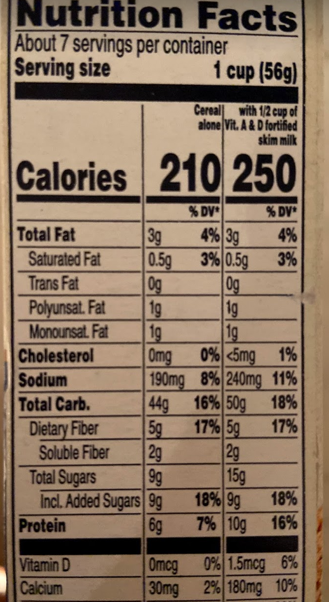

I usually only write about my own mistakes, but here I'm going to be writing about a mistake I noticed an error on the nutrition label of Quaker Oatmeal Squares cereal. The error is extremely minor (at least as far as I can tell), but it made me think—this label has been printed and seen probably millions of times, and yet this error remains on the box to this day (as of mid-August 2020).

I've included a photo of the label below. Can you see the error (or, really, inconsistency)?

Don't see it? Compare the percent daily value (% DV) for protein across the "cereal alone" and "with 1/2 cup of milk" categories. The cereal alone has 6 grams of protein, corresponding to 7% DV; the cereal with half a cup of milk has 10 grams of protein, corresponding to 16% DV.

Maybe I misunderstand nutrition labels, but surely both of these can't be correct. If 6 grams is 7% of the daily recommended amount of protein, then the total recommended amount of protein would be `6/x = 7/100 -> 7x = 600 -> 600/7 = x` 86 grams of protein. If 10 grams is 16% the daily recommended amount of protein, then the total recommended amount would be `10/x = 16/100 -> 1000 = 16x -> 1000/16 = x` 63 grams of protein.

As far as I know, the daily recommended amount of protein used for these nutrition labels can't be simultaneously 63 grams and 86 grams? There must be an error somewhere.

> If you're wondering how I found this error, it's because the front of the box advertises 10g of protein per serving. This seemed high for a cereal, so I looked at the protein section of the nutrition label, which is where I spotted this.